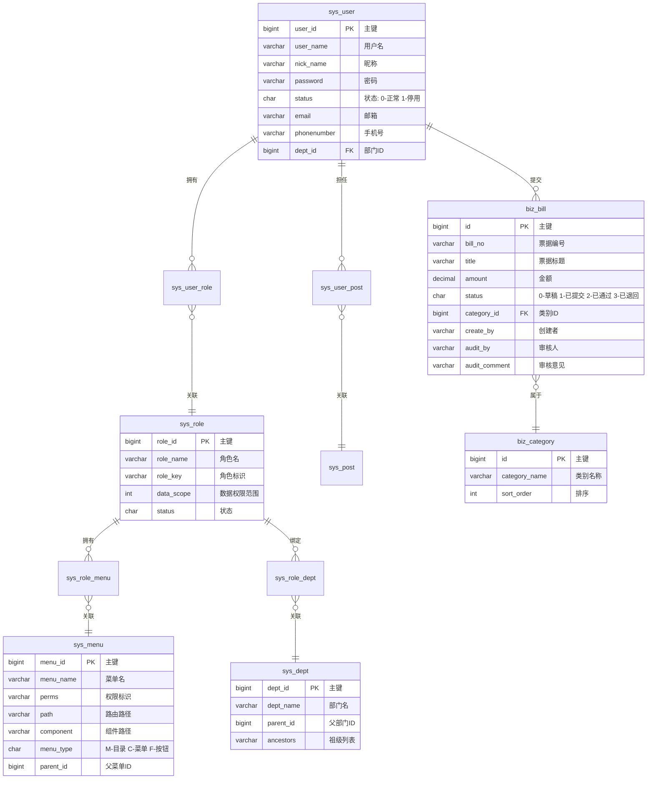

# E-R 图

## 核心实体关系

## 实体清单

| 实体 | 表名 | 说明 |
|------|------|------|
| 用户 | sys_user | 系统用户，扩展 BaseEntity |
| 角色 | sys_role | 角色，关联菜单和数据权限 |
| 菜单 | sys_menu | 菜单/权限树，扩展 TreeEntity |
| 部门 | sys_dept | 组织架构树，扩展 TreeEntity |
| 岗位 | sys_post | 用户岗位 |
| 票据 | biz_bill | 核心业务实体（待实现） |
| 票据类别 | biz_category | 票据分类 |

## 关键关系

- **用户 ↔ 角色**: N:M，通过 `sys_user_role` 关联
- **角色 ↔ 菜单**: N:M，通过 `sys_role_menu` 关联（RBAC 权限模型）
- **角色 ↔ 部门**: 1:N，通过 `sys_role_dept` 关联（数据权限）
- **用户 → 票据**: 1:N，一个用户可提交多张票据
- **票据 → 类别**: N:1，每张票据属于一个类别

## 相关笔记

- [[详细设计]]
- [[需求规格说明]]
- [[../02-后端开发/数据库设计|数据库设计]]
