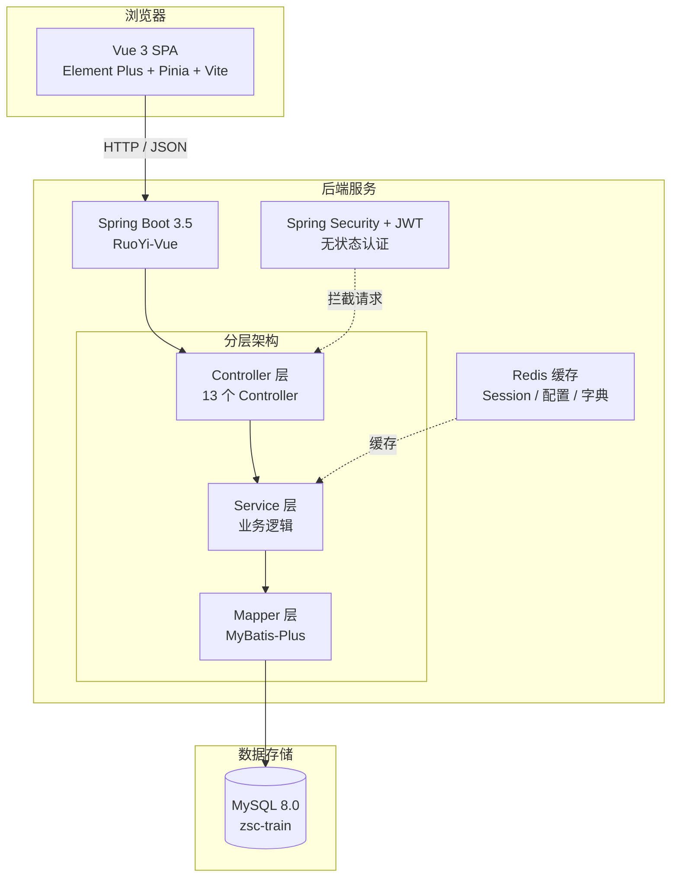

# 系统架构图



## 架构要点

- **前后端分离**: Vue 3 SPA 通过 HTTP 与 Spring Boot 通信
- **后端分层**: Controller → Service → Mapper → DB
- **安全层**: Spring Security + JWT 无状态认证，`JwtAuthenticationTokenFilter` 拦截每个请求
- **缓存层**: Redis 缓存 LoginUser、系统配置、字典数据
- **连接池**: Druid 管理 MySQL 连接，监控面板 `/druid/*`
- **API 文档**: SpringDoc OpenAPI (Swagger)，地址 `/swagger-ui/index.html`

## 请求链路

```mermaid
sequenceDiagram
    participant Browser as 浏览器
    participant Filter as JWT Filter
    participant Controller as Controller
    participant Service as Service
    participant Mapper as Mapper
    participant DB as MySQL
    participant Redis as Redis

    Browser->>Filter: Authorization: Bearer &lt;token&gt;
    Filter->>Redis: 查询 login_tokens:&lt;uuid&gt;
    Redis-->>Filter: LoginUser 信息
    Filter->>Filter: 设置 SecurityContext
    Filter->>Controller: 请求到达
    Controller->>Service: 调用业务逻辑
    Service->>Mapper: 执行查询
    Mapper->>DB: SQL
    DB-->>Mapper: 结果
    Mapper-->>Service: Entity
    Service-->>Controller: 处理结果
    Controller-->>Browser: JSON 响应
```

## 相关笔记

- [[概要设计]]
- [[../02-后端开发/后端总览|后端总览]]
- [[../03-前端开发/前端总览|前端总览]]
