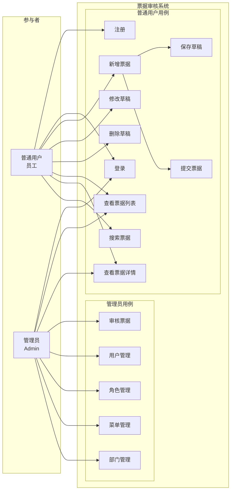

# 用例图

## 参与者 (Actor)

| 参与者 | 说明 | 获得方式 |
|--------|------|----------|
| 普通用户 | 提交票据的员工 | 自行注册 或 管理员添加 |
| 管理员 | 审核票据、管理系统 | 系统预置 |

## 用例详细说明

### 普通用户用例

| 用例 | 描述 | 前置条件 |
|------|------|----------|
| 注册 | 填写用户名/密码/验证码注册账号 | 系统开启注册功能 |
| 登录 | 用户名/密码/验证码登录 | 账号未被冻结 |
| 新增票据 | 填写票据信息，可选"保存草稿"或"提交" | 已登录 |
| 修改草稿 | 编辑状态为"草稿"的票据 | 票据状态=草稿，且为本人票据 |
| 删除草稿 | 删除状态为"草稿"的票据 | 票据状态=草稿，且为本人票据 |
| 查看票据列表 | 按状态筛选（全部/草稿/待审核/已通过/已退回） | 已登录 |
| 查看票据详情 | 查看票据完整信息和审核意见 | 已登录 |
| 搜索票据 | 按关键词、类型、日期范围搜索 | 已登录 |

### 管理员用例

| 用例 | 描述 | 前置条件 |
|------|------|----------|
| 审核票据 | 对已提交的票据做出"通过"或"退回"决定，填写审核意见 | 管理员登录 |
| 用户管理 | 用户 CRUD、密码重置、账号冻结/解冻 | 管理员登录 |
| 角色管理 | 角色 CRUD、分配菜单权限、设置数据权限 | 管理员登录 |
| 菜单管理 | 菜单 CRUD、管理前端路由和按钮权限 | 管理员登录 |
| 部门管理 | 部门树维护 | 管理员登录 |

## 相关笔记

- [[需求规格说明]]
- [[概要设计]]
