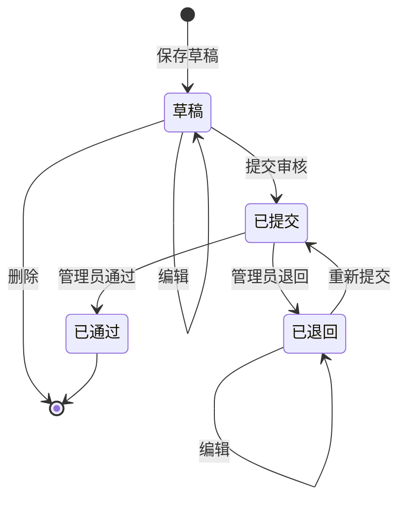
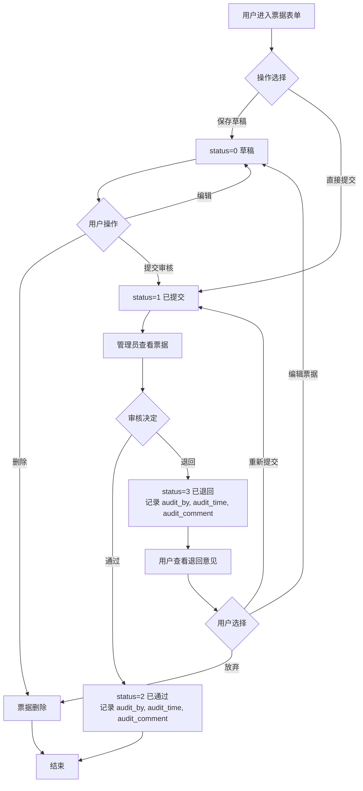
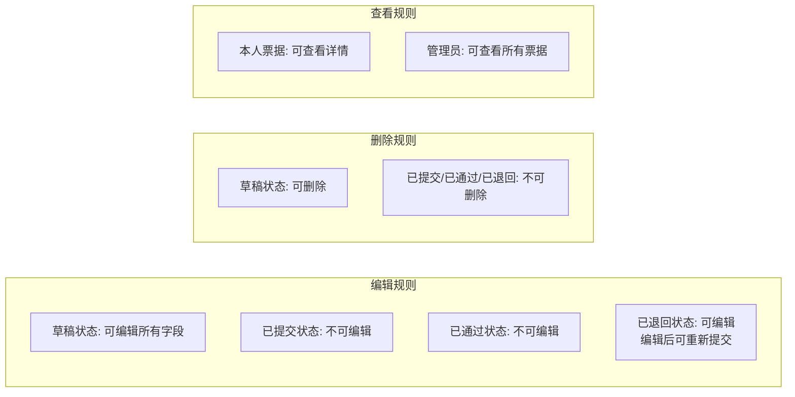

# 票据状态流程

## 状态说明

| 状态 | 标识 | 说明 | 可执行操作 |
|------|------|------|------------|
| 草稿 | 0 | 临时保存，未提交 | 编辑、删除、提交 |
| 已提交 | 1 | 已提交，待审核 | 查看（不可编辑） |
| 已通过 | 2 | 管理员审核通过 | 查看（终态） |
| 已退回 | 3 | 管理员审核退回 | 编辑、重新提交 |

## 状态流转

## 详细状态流

## 业务规则

| 规则 | 草稿 | 已提交 | 已通过 | 已退回 |
|------|:----:|:------:|:------:|:------:|
| 编辑 | ✓ | ✗ | ✗ | ✓ |
| 删除 | ✓ | ✗ | ✗ | ✗ |
| 提交审核 | ✓ | ✗ | ✗ | — |
| 重新提交 | ✗ | ✗ | ✗ | ✓ |
| 查看详情 | ✓ | ✓ | ✓ | ✓ |
| 审核 | ✗ | ✓ | ✗ | ✗ |

## 相关笔记

- [[需求规格说明]]
- [[详细设计]]
- [[../02-后端开发/模块说明/zsc-module|zsc-module (票据业务模块)]]
