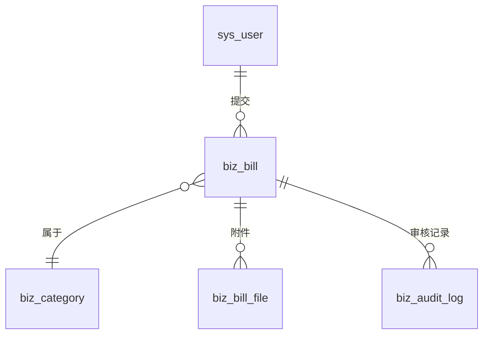

# 数据库设计

## 数据库信息

| 项目 | 值 |
|------|-----|
| 数据库名 | `zsc-train` |
| 字符集 | `utf8mb4` |
| 排序规则 | `utf8mb4_general_ci` |
| 连接池 | Druid（监控 `/druid/*`，账号 `zsc / 123456`） |
| ORM | MyBatis-Plus，`map-underscore-to-camel-case: true`，`id-type: auto` |

## SQL 脚本管理

采用方案二（基准文件 + 增量迁移），见 [sql/README.md](../../zsc_backend/sql/README.md)。

```
sql/
├── zsc.sql                    # 基准文件：RuoYi 框架全部建表 + 种子数据
└── migrations/
    ├── 01_biz_category.sql    # 业务类别表
    ├── 02_add_bill_table.sql  # 票据主表
    ├── 03_add_bill_file_table.sql  # 票据附件表
    └── 04_add_audit_log_table.sql  # 审核记录表
```

- **新组员**: 跑 `zsc.sql` → 按序号跑所有 migrations
- **已有数据库**: 只跑上次之后新增的 migration 文件

---

## 系统表（RuoYi 框架自带，15 张）

### sys_user — 系统用户

| 字段 | 类型 | 约束 | 说明 |
|------|------|------|------|
| user_id | bigint(20) | PK, AUTO_INCREMENT | 用户ID |
| dept_id | bigint(20) | DEFAULT NULL | 部门ID |
| user_name | varchar(30) | NOT NULL | 用户名 |
| nick_name | varchar(30) | NOT NULL | 昵称 |
| user_type | varchar(2) | DEFAULT '00' | 用户类型（00=系统用户） |
| email | varchar(50) | DEFAULT '' | 邮箱 |
| phonenumber | varchar(11) | DEFAULT '' | 手机号 |
| sex | char(1) | DEFAULT '0' | 性别（0=男 1=女 2=未知） |
| avatar | varchar(100) | DEFAULT '' | 头像路径 |
| password | varchar(100) | DEFAULT '' | 密码（BCrypt 加密） |
| status | char(1) | DEFAULT '0' | 状态（0=正常 1=停用） |
| del_flag | char(1) | DEFAULT '0' | 删除标记（0=存在 2=删除） |
| login_ip | varchar(128) | DEFAULT '' | 最后登录IP |
| login_date | datetime | DEFAULT NULL | 最后登录时间 |
| create_by | varchar(64) | DEFAULT '' | 创建者 |
| create_time | datetime | DEFAULT NULL | 创建时间 |
| update_by | varchar(64) | DEFAULT '' | 更新者 |
| update_time | datetime | DEFAULT NULL | 更新时间 |
| remark | varchar(500) | DEFAULT NULL | 备注 |

索引: `uk_user_name` (user_name)

> 💡 示例数据

| user_id | dept_id | user_name | nick_name | user_type | email | phonenumber | sex | status | del_flag | create_time |
|---------|---------|-----------|-----------|-----------|-------|-------------|-----|--------|----------|-------------|
| 1 | 103 | admin | 管理员 | 00 | admin@zsc.com | 13800138000 | 0 | 0 | 0 | 2026-01-01 09:00:00 |

### sys_role — 角色

| 字段 | 类型 | 约束 | 说明 |
|------|------|------|------|
| role_id | bigint(20) | PK, AUTO_INCREMENT | 角色ID |
| role_name | varchar(30) | NOT NULL | 角色名称 |
| role_key | varchar(100) | NOT NULL | 角色标识（如 `admin`, `common`） |
| role_sort | int(4) | NOT NULL | 排序 |
| data_scope | char(1) | DEFAULT '1' | 数据权限范围: 1-全部 2-自定义 3-本部门 4-本部门及子部门 5-仅本人 |
| menu_check_strictly | tinyint(1) | DEFAULT 1 | 菜单树是否关联选择 |
| dept_check_strictly | tinyint(1) | DEFAULT 1 | 部门树是否关联选择 |
| status | char(1) | NOT NULL | 状态（0=正常 1=停用） |
| del_flag | char(1) | DEFAULT '0' | 删除标记 |
| create_by | varchar(64) | DEFAULT '' | 创建者 |
| create_time | datetime | DEFAULT NULL | 创建时间 |
| update_by | varchar(64) | DEFAULT '' | 更新者 |
| update_time | datetime | DEFAULT NULL | 更新时间 |
| remark | varchar(500) | DEFAULT NULL | 备注 |

> 💡 示例数据

| role_id | role_name | role_key | role_sort | data_scope | status | del_flag | create_time |
|---------|-----------|----------|-----------|------------|--------|----------|-------------|
| 1 | 超级管理员 | admin | 1 | 1 | 0 | 0 | 2026-01-01 09:00:00 |

### sys_menu — 菜单/权限

| 字段 | 类型 | 约束 | 说明 |
|------|------|------|------|
| menu_id | bigint(20) | PK, AUTO_INCREMENT | 菜单ID |
| menu_name | varchar(50) | NOT NULL | 菜单名称 |
| parent_id | bigint(20) | DEFAULT 0 | 父菜单ID |
| order_num | int(4) | DEFAULT 0 | 排序 |
| path | varchar(200) | DEFAULT '' | 路由路径 |
| component | varchar(255) | DEFAULT NULL | 组件路径 |
| query | varchar(255) | DEFAULT NULL | 路由参数 |
| route_name | varchar(50) | DEFAULT '' | 路由名称 |
| is_frame | int(1) | DEFAULT 1 | 是否外链（1=是 0=否） |
| is_cache | int(1) | DEFAULT 0 | 是否缓存（0=不缓存 1=缓存） |
| menu_type | char(1) | DEFAULT '' | 类型: M=目录 C=菜单 F=按钮 |
| visible | char(1) | DEFAULT '0' | 是否显示（0=显示 1=隐藏） |
| status | char(1) | DEFAULT '0' | 状态 |
| perms | varchar(100) | DEFAULT NULL | 权限标识（如 `system:user:list`） |
| icon | varchar(100) | DEFAULT '#' | 菜单图标 |
| create_by | varchar(64) | DEFAULT '' | 创建者 |
| create_time | datetime | DEFAULT NULL | 创建时间 |
| update_by | varchar(64) | DEFAULT '' | 更新者 |
| update_time | datetime | DEFAULT NULL | 更新时间 |
| remark | varchar(500) | DEFAULT '' | 备注 |

> 💡 示例数据

| menu_id | menu_name | parent_id | order_num | path | component | menu_type | visible | status | perms | icon | create_time |
|---------|-----------|-----------|-----------|------|-----------|-----------|---------|--------|-------|------|-------------|
| 100 | 系统管理 | 0 | 1 | system | null | M | 0 | 0 | null | system | 2026-01-01 09:00:00 |

### sys_dept — 部门

| 字段 | 类型 | 约束 | 说明 |
|------|------|------|------|
| dept_id | bigint(20) | PK, AUTO_INCREMENT | 部门ID |
| parent_id | bigint(20) | DEFAULT 0 | 父部门ID |
| ancestors | varchar(50) | DEFAULT '' | 祖级列表（如 `0,100,200`） |
| dept_name | varchar(30) | DEFAULT '' | 部门名称 |
| order_num | int(4) | DEFAULT 0 | 排序 |
| leader | varchar(20) | DEFAULT NULL | 负责人 |
| phone | varchar(11) | DEFAULT NULL | 联系电话 |
| email | varchar(50) | DEFAULT NULL | 邮箱 |
| status | char(1) | DEFAULT '0' | 状态 |
| del_flag | char(1) | DEFAULT '0' | 删除标记 |
| create_by | varchar(64) | DEFAULT '' | 创建者 |
| create_time | datetime | DEFAULT NULL | 创建时间 |
| update_by | varchar(64) | DEFAULT '' | 更新者 |
| update_time | datetime | DEFAULT NULL | 更新时间 |

> 💡 示例数据

| dept_id | parent_id | ancestors | dept_name | order_num | leader | status | del_flag | create_time |
|---------|-----------|-----------|-----------|-----------|--------|--------|----------|-------------|
| 103 | 100 | 0,100 | 研发部 | 1 | 张三 | 0 | 0 | 2026-01-01 09:00:00 |

### sys_post — 岗位

| 字段 | 类型 | 约束 | 说明 |
|------|------|------|------|
| post_id | bigint(20) | PK, AUTO_INCREMENT | 岗位ID |
| post_code | varchar(64) | NOT NULL | 岗位编码 |
| post_name | varchar(50) | NOT NULL | 岗位名称 |
| post_sort | int(4) | NOT NULL | 排序 |
| status | char(1) | NOT NULL | 状态 |
| create_by | varchar(64) | DEFAULT '' | 创建者 |
| create_time | datetime | DEFAULT NULL | 创建时间 |
| update_by | varchar(64) | DEFAULT '' | 更新者 |
| update_time | datetime | DEFAULT NULL | 更新时间 |
| remark | varchar(500) | DEFAULT NULL | 备注 |

> 💡 示例数据

| post_id | post_code | post_name | post_sort | status | create_time |
|---------|-----------|-----------|-----------|--------|-------------|
| 1 | ceo | 董事长 | 1 | 0 | 2026-01-01 09:00:00 |

### sys_dict_type — 字典类型

| 字段 | 类型 | 约束 | 说明 |
|------|------|------|------|
| dict_id | bigint(20) | PK, AUTO_INCREMENT | 字典类型ID |
| dict_name | varchar(100) | DEFAULT '' | 字典名称（如"用户状态"） |
| dict_type | varchar(100) | DEFAULT '' | 字典类型（如 `sys_user_sex`） |
| status | char(1) | DEFAULT '0' | 状态 |
| create_by | varchar(64) | DEFAULT '' | 创建者 |
| create_time | datetime | DEFAULT NULL | 创建时间 |
| update_by | varchar(64) | DEFAULT '' | 更新者 |
| update_time | datetime | DEFAULT NULL | 更新时间 |
| remark | varchar(500) | DEFAULT NULL | 备注 |

索引: `uk_dict_type` (dict_type)

> 💡 示例数据

| dict_id | dict_name | dict_type | status | create_time |
|---------|-----------|-----------|--------|-------------|
| 1 | 用户性别 | sys_user_sex | 0 | 2026-01-01 09:00:00 |

### sys_dict_data — 字典数据

| 字段 | 类型 | 约束 | 说明 |
|------|------|------|------|
| dict_code | bigint(20) | PK, AUTO_INCREMENT | 数据ID |
| dict_sort | int(4) | DEFAULT 0 | 排序 |
| dict_label | varchar(100) | DEFAULT '' | 显示标签（如"男"） |
| dict_value | varchar(100) | DEFAULT '' | 字典值（如 `"0"`） |
| dict_type | varchar(100) | DEFAULT '' | 所属字典类型 |
| css_class | varchar(100) | DEFAULT NULL | 样式类名 |
| list_class | varchar(100) | DEFAULT NULL | 表格回显样式 |
| is_default | char(1) | DEFAULT 'N' | 是否默认 |
| status | char(1) | DEFAULT '0' | 状态 |
| create_by | varchar(64) | DEFAULT '' | 创建者 |
| create_time | datetime | DEFAULT NULL | 创建时间 |
| update_by | varchar(64) | DEFAULT '' | 更新者 |
| update_time | datetime | DEFAULT NULL | 更新时间 |
| remark | varchar(500) | DEFAULT NULL | 备注 |

> 💡 示例数据

| dict_code | dict_sort | dict_label | dict_value | dict_type | is_default | status | create_time |
|-----------|-----------|------------|------------|-----------|------------|--------|-------------|
| 1 | 0 | 男 | 0 | sys_user_sex | Y | 0 | 2026-01-01 09:00:00 |

### sys_config — 系统参数配置

| 字段 | 类型 | 约束 | 说明 |
|------|------|------|------|
| config_id | int(5) | PK, AUTO_INCREMENT | 配置ID |
| config_name | varchar(100) | DEFAULT '' | 参数名称 |
| config_key | varchar(100) | DEFAULT '' | 参数键名 |
| config_value | varchar(500) | DEFAULT '' | 参数值 |
| config_type | char(1) | DEFAULT 'N' | 是否系统内置（Y=是 N=否） |
| create_by | varchar(64) | DEFAULT '' | 创建者 |
| create_time | datetime | DEFAULT NULL | 创建时间 |
| update_by | varchar(64) | DEFAULT '' | 更新者 |
| update_time | datetime | DEFAULT NULL | 更新时间 |
| remark | varchar(500) | DEFAULT NULL | 备注 |

> 💡 示例数据

| config_id | config_name | config_key | config_value | config_type | create_time |
|-----------|-------------|------------|--------------|-------------|-------------|
| 1 | 主框架页-默认皮肤 | sys.index.skinName | skin-blue | Y | 2026-01-01 09:00:00 |

### sys_notice — 通知公告

| 字段 | 类型 | 约束 | 说明 |
|------|------|------|------|
| notice_id | int(4) | PK, AUTO_INCREMENT | 公告ID |
| notice_title | varchar(50) | NOT NULL | 标题 |
| notice_type | char(1) | NOT NULL | 类型（1=通知 2=公告） |
| notice_content | longblob | DEFAULT NULL | 内容（富文本） |
| status | char(1) | DEFAULT '0' | 状态 |
| create_by | varchar(64) | DEFAULT '' | 创建者 |
| create_time | datetime | DEFAULT NULL | 创建时间 |
| update_by | varchar(64) | DEFAULT '' | 更新者 |
| update_time | datetime | DEFAULT NULL | 更新时间 |
| remark | varchar(255) | DEFAULT NULL | 备注 |

> 💡 示例数据

| notice_id | notice_title | notice_type | status | create_by | create_time |
|-----------|--------------|-------------|--------|-----------|-------------|
| 1 | 系统上线公告 | 2 | 0 | admin | 2026-05-01 09:00:00 |

### sys_oper_log — 操作日志

| 字段 | 类型 | 约束 | 说明 |
|------|------|------|------|
| oper_id | bigint(20) | PK, AUTO_INCREMENT | 日志ID |
| title | varchar(50) | DEFAULT '' | 模块标题 |
| business_type | int(2) | DEFAULT 0 | 业务类型: 0-其他 1-新增 2-修改 3-删除 4-导出 5-导入 |
| method | varchar(100) | DEFAULT '' | 方法名（全限定名） |
| request_method | varchar(10) | DEFAULT '' | 请求方式 |
| operator_type | int(1) | DEFAULT 0 | 操作人类型: 0-后台 1-手机端 |
| oper_name | varchar(50) | DEFAULT '' | 操作人员 |
| dept_name | varchar(50) | DEFAULT '' | 部门名称 |
| oper_url | varchar(255) | DEFAULT '' | 请求URL |
| oper_ip | varchar(128) | DEFAULT '' | 操作IP |
| oper_location | varchar(255) | DEFAULT '' | 操作地点 |
| oper_param | varchar(2000) | DEFAULT '' | 请求参数 |
| json_result | varchar(2000) | DEFAULT '' | 返回参数 |
| status | int(1) | DEFAULT 0 | 状态: 0-正常 1-异常 |
| error_msg | varchar(2000) | DEFAULT '' | 错误信息 |
| oper_time | datetime | DEFAULT NULL | 操作时间 |
| cost_time | bigint(20) | DEFAULT 0 | 耗时（ms） |

> 💡 示例数据

| oper_id | title | business_type | method | request_method | oper_name | oper_url | oper_ip | status | oper_time | cost_time |
|---------|-------|---------------|--------|----------------|-----------|----------|---------|--------|-----------|-----------|
| 1001 | 用户管理 | 2 | com.zsc.controller.SysUserController.edit() | PUT | admin | /system/user | 127.0.0.1 | 0 | 2026-05-23 10:30:00 | 120 |

### sys_logininfor — 登录日志

| 字段 | 类型 | 约束 | 说明 |
|------|------|------|------|
| info_id | bigint(20) | PK, AUTO_INCREMENT | 日志ID |
| user_name | varchar(50) | DEFAULT '' | 用户名 |
| ipaddr | varchar(128) | DEFAULT '' | 登录IP |
| login_location | varchar(255) | DEFAULT '' | 登录地点 |
| browser | varchar(50) | DEFAULT '' | 浏览器 |
| os | varchar(50) | DEFAULT '' | 操作系统 |
| status | char(1) | DEFAULT '0' | 状态: 0-成功 1-失败 |
| msg | varchar(255) | DEFAULT '' | 提示信息 |
| login_time | datetime | DEFAULT NULL | 登录时间 |

> 💡 示例数据

| info_id | user_name | ipaddr | login_location | browser | os | status | msg | login_time |
|---------|-----------|--------|----------------|---------|----|--------|-----|------------|
| 501 | admin | 192.168.1.100 | 内网IP | Chrome 120 | Windows 11 | 0 | 登录成功 | 2026-05-23 08:30:00 |

### sys_user_role — 用户-角色关联

| 字段 | 类型 | 约束 | 说明 |
|------|------|------|------|
| user_id | bigint(20) | NOT NULL | 用户ID |
| role_id | bigint(20) | NOT NULL | 角色ID |

PRIMARY KEY (user_id, role_id)

> 💡 示例数据

| user_id | role_id |
|---------|---------|
| 1 | 1 |

### sys_role_menu — 角色-菜单关联

| 字段 | 类型 | 约束 | 说明 |
|------|------|------|------|
| role_id | bigint(20) | NOT NULL | 角色ID |
| menu_id | bigint(20) | NOT NULL | 菜单ID |

PRIMARY KEY (role_id, menu_id)

> 💡 示例数据

| role_id | menu_id |
|---------|---------|
| 1 | 100 |

### sys_role_dept — 角色-部门关联

| 字段 | 类型 | 约束 | 说明 |
|------|------|------|------|
| role_id | bigint(20) | NOT NULL | 角色ID |
| dept_id | bigint(20) | NOT NULL | 部门ID |

PRIMARY KEY (role_id, dept_id)

> 💡 示例数据

| role_id | dept_id |
|---------|---------|
| 1 | 103 |

### sys_user_post — 用户-岗位关联

| 字段 | 类型 | 约束 | 说明 |
|------|------|------|------|
| user_id | bigint(20) | NOT NULL | 用户ID |
| post_id | bigint(20) | NOT NULL | 岗位ID |

PRIMARY KEY (user_id, post_id)

> 💡 示例数据

| user_id | post_id |
|---------|---------|
| 1 | 1 |

---

## Quartz 定时任务表（2 张）

### sys_job — 定时任务

| 字段 | 类型 | 约束 | 说明 |
|------|------|------|------|
| job_id | bigint(20) | PK, AUTO_INCREMENT | 任务ID |
| job_name | varchar(64) | NOT NULL | 任务名称 |
| job_group | varchar(64) | NOT NULL | 任务组名 |
| invoke_target | varchar(500) | NOT NULL | 调用目标字符串（如 `ryTask.ryParams('hello')`） |
| cron_expression | varchar(255) | DEFAULT '' | Cron 表达式 |
| misfire_policy | varchar(20) | DEFAULT '3' | 计划执行错误策略: 1-立即 2-单次 3-放弃 |
| concurrent | char(1) | DEFAULT '1' | 是否并发: 0-允许 1-禁止 |
| status | char(1) | DEFAULT '0' | 状态: 0-正常 1-暂停 |
| create_by | varchar(64) | DEFAULT '' | 创建者 |
| create_time | datetime | DEFAULT NULL | 创建时间 |
| update_by | varchar(64) | DEFAULT '' | 更新者 |
| update_time | datetime | DEFAULT NULL | 更新时间 |
| remark | varchar(500) | DEFAULT '' | 备注 |

> 💡 示例数据

| job_id | job_name | job_group | invoke_target | cron_expression | misfire_policy | concurrent | status | create_time |
|--------|----------|-----------|---------------|-----------------|----------------|------------|--------|-------------|
| 1 | 无参同步 | DEFAULT | ryTask.ryNoParams | 0 0/10 * * * ? | 3 | 1 | 0 | 2026-01-01 09:00:00 |

### sys_job_log — 定时任务执行日志

| 字段 | 类型 | 约束 | 说明 |
|------|------|------|------|
| job_log_id | bigint(20) | PK, AUTO_INCREMENT | 日志ID |
| job_name | varchar(64) | NOT NULL | 任务名称 |
| job_group | varchar(64) | NOT NULL | 任务组名 |
| invoke_target | varchar(500) | NOT NULL | 调用目标字符串 |
| job_message | varchar(500) | DEFAULT NULL | 日志信息 |
| status | char(1) | DEFAULT '0' | 状态: 0-成功 1-失败 |
| exception_info | varchar(2000) | DEFAULT '' | 异常信息 |
| create_time | datetime | DEFAULT NULL | 创建时间 |

> 💡 示例数据

| job_log_id | job_name | job_group | invoke_target | job_message | status | create_time |
|------------|----------|-----------|---------------|-------------|--------|-------------|
| 1001 | 无参同步 | DEFAULT | ryTask.ryNoParams | 执行成功 | 0 | 2026-05-23 10:00:00 |

---

## 业务表（4 张）

### biz_category — 业务类别

> SQL: `migrations/01_biz_category.sql`

| 字段 | 类型 | 约束 | 说明 |
|------|------|------|------|
| category_id | bigint(20) | PK, AUTO_INCREMENT | 类别ID |
| category_name | varchar(100) | NOT NULL | 类别名称（如"办公用品"、"差旅费"） |
| sort_order | int(11) | DEFAULT 0 | 排序 |
| status | char(1) | DEFAULT '0' | 状态（0=正常 1=停用） |
| create_time | datetime | DEFAULT NULL | 创建时间 |
| update_time | datetime | DEFAULT NULL | 更新时间 |

> 💡 示例数据

| category_id | category_name | sort_order | status | create_time |
|-------------|---------------|------------|--------|-------------|
| 1 | 办公用品 | 1 | 0 | 2026-01-01 09:00:00 |

### biz_bill — 票据主表

> SQL: `migrations/02_add_bill_table.sql`

| 字段            | 类型            | 约束                 | 说明                         |
| ------------- | ------------- | ------------------ | -------------------------- |
| id            | bigint(20)    | PK, AUTO_INCREMENT | 主键                         |
| bill_no       | varchar(32)   | NOT NULL, UNIQUE   | 票据编号（自动生成）                 |
| title         | varchar(255)  | NOT NULL           | 票据标题                       |
| category_id   | bigint(20)    | DEFAULT NULL       | 票据类别ID                     |
| amount        | decimal(10,2) | NOT NULL           | 金额                         |
| description   | varchar(500)  | DEFAULT NULL       | 描述                         |
| status        | char(1)       | DEFAULT '0'        | 状态: 0=草稿 1=已提交 2=已通过 3=已退回 |
| attachment    | varchar(500)  | DEFAULT NULL       | 附件路径（单文件，保留兼容）             |
| create_by     | varchar(64)   | DEFAULT NULL       | 创建者                        |
| create_time   | datetime      | DEFAULT NULL       | 创建时间                       |
| update_by     | varchar(64)   | DEFAULT NULL       | 更新者                        |
| update_time   | datetime      | DEFAULT NULL       | 更新时间                       |
| audit_by      | varchar(64)   | DEFAULT NULL       | 最近审核人                      |
| audit_time    | datetime      | DEFAULT NULL       | 最近审核时间                     |
| audit_comment | varchar(500)  | DEFAULT NULL       | 最近审核意见                     |
| remark        | varchar(500)  | DEFAULT NULL       | 备注                         |

索引: `uk_bill_no` (bill_no), `idx_create_by`, `idx_status`, `idx_category_id`, `idx_create_time`

> 💡 示例数据

| id | bill_no | title | category_id | amount | description | status | create_by | create_time | audit_by | audit_time | audit_comment |
|----|---------|-------|-------------|--------|-------------|--------|-----------|-------------|----------|------------|---------------|
| 1 | BL202605230001 | 购买办公桌 | 1 | 3500.00 | 研发部采购办公桌一批 | 1 | admin | 2026-05-23 09:30:00 | ry | 2026-05-23 14:00:00 | 同意报销 |

### biz_bill_file — 票据附件

> SQL: `migrations/03_add_bill_file_table.sql`

与 `biz_bill` 是 **1:N** 关系，一张票据可上传多个附件。

| 字段 | 类型 | 约束 | 说明 |
|------|------|------|------|
| id | bigint(20) | PK, AUTO_INCREMENT | 主键 |
| bill_id | bigint(20) | NOT NULL | 票据ID |
| file_name | varchar(255) | NOT NULL | 原始文件名 |
| file_path | varchar(500) | NOT NULL | 存储路径（相对路径） |
| file_size | bigint(20) | DEFAULT NULL | 文件大小（字节） |
| file_type | varchar(50) | DEFAULT NULL | 文件类型 / 扩展名 |
| sort_order | int(11) | DEFAULT 0 | 排序（同票据内附件显示顺序） |
| create_by | varchar(64) | DEFAULT NULL | 上传者 |
| create_time | datetime | DEFAULT NULL | 上传时间 |

索引: `idx_bill_id` (bill_id)

> 💡 示例数据

| id | bill_id | file_name | file_path | file_size | file_type | sort_order | create_by | create_time |
|----|---------|-----------|-----------|-----------|-----------|------------|-----------|-------------|
| 1 | 1 | 发票_20260523.pdf | /upload/2026/05/invoice_001.pdf | 245760 | pdf | 0 | admin | 2026-05-23 09:30:00 |

### biz_audit_log — 审核记录

> SQL: `migrations/04_add_audit_log_table.sql`

与 `biz_bill` 是 **1:N** 关系，一张票据可被多次审核（退回后重新提交）。完整追溯审核历史。

| 字段 | 类型 | 约束 | 说明 |
|------|------|------|------|
| id | bigint(20) | PK, AUTO_INCREMENT | 主键 |
| bill_id | bigint(20) | NOT NULL | 票据ID |
| action | char(1) | NOT NULL | 操作: 1=通过 2=退回 |
| comment | varchar(500) | DEFAULT NULL | 审核意见 |
| audit_by | varchar(64) | NOT NULL | 审核人 |
| audit_time | datetime | NOT NULL | 审核时间 |

索引: `idx_bill_id` (bill_id), `idx_audit_by`, `idx_audit_time`

> 💡 示例数据

| id | bill_id | action | comment | audit_by | audit_time |
|----|---------|--------|---------|----------|------------|
| 1 | 1 | 1 | 材料齐全，同意报销 | ry | 2026-05-23 14:00:00 |

---

## 业务表 ER 关系



---

## RBAC 权限模型

```
sys_user ──N:M── sys_user_role ──── sys_role ──N:M── sys_role_menu ──── sys_menu
```

- `sys_menu.perms` 存储权限标识符（如 `system:user:list`）
- 用户登录时，5 表 JOIN 查出用户所有权限字符串
- 前端: `v-hasPermi` 指令 + 路由 `permissions` 属性
- 后端: `@PreAuthorize("@ss.hasPermi('xxx')")`

## 数据权限 (DataScope)

`sys_role.data_scope` 控制数据可见范围：

| 值 | 含义 |
|----|------|
| 1 | 全部数据权限 |
| 2 | 自定义数据权限（通过 `sys_role_dept` 关联） |
| 3 | 本部门数据权限 |
| 4 | 本部门及子部门 |
| 5 | 仅本人数据 |

通过 `@DataScope` 注解 + `DataScopeAspect` 切面动态注入 SQL 条件实现。

## 相关笔记

- [[权限管理]]
- [[../01-需求与设计/详细设计|详细设计]]
- [[../01-需求与设计/E-R图|E-R 图]]
- [[后端总览]]
- [[模块说明/zsc-system|zsc-system]]
- [[模块说明/zsc-module|zsc-module]]
